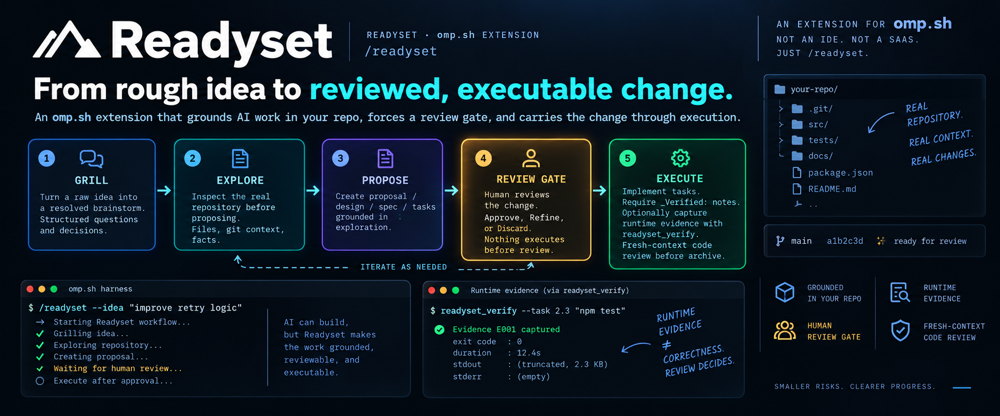

{=html}

<a href="#why-readyset">{=html}<b>{=html}Why</b>{=html}</a>{=html}
· <a href="#how-it-works">{=html}<b>{=html}How it
works</b>{=html}</a>{=html} ·
<a href="#install">{=html}<b>{=html}Install</b>{=html}</a>{=html}
· <a href="#use">{=html}<b>{=html}Use</b>{=html}</a>{=html} ·
<a href="#runtime-evidence">{=html}<b>{=html}Evidence</b>{=html}</a>{=html}
·
<a href="#limitations">{=html}<b>{=html}Limitations</b>{=html}</a>{=html}

Readyset

Turn rough ideas into grounded, reviewable, executable changes ---
inside omp.

Readyset is a standalone omp extension, invoked as /readyset.

It adds a structured workflow around the jump from "I have an idea"
to "the agent is changing my code":

Rough idea
    │
    ▼
  GRILL ──────── resolve ambiguity
    │
    ▼
 EXPLORE ─────── ground in the real repository
    │
    ▼
 PROPOSE ─────── write the change artifacts
    │
    ▼
 REVIEW ──────── human approval / refine / discard
    │
    ▼
 EXECUTE ─────── implement, verify, code-review
    │
    ▼
 ARCHIVE ─────── preserve the resulting change

The important part is that these are not merely instructions in a
prompt. Readyset uses code-enforced gates around the workflow.

Readyset is not another coding agent or IDE. It is a workflow layer
for omp that makes the path from idea to implementation explicit,
grounded, reviewable, and executable.

Why Readyset?

Coding agents are very good at moving quickly from an instruction to
implementation.

The problem is what can disappear in that jump:

ambiguous product decisions

assumptions about the existing repository

requirements that were never grounded in actual code

plans that quietly omit part of the requested scope

changes executed before anyone reviews the proposed approach

"verified" claims that are only self-reported

context that becomes difficult to reconstruct after the change

Readyset is designed around those failure modes.

It combines three influences:

omp /plan's grounding discipline --- use real repository
evidence, cite actual files and commits, and leave behind something
an engineer can execute.

Structured spec-driven workflows --- separate proposal, design,
requirements/specs, and tasks, while carrying unresolved decisions
forward instead of silently inventing them.

mattpocock/skills-style prompting hygiene --- interrogate
ambiguity before writing the plan, don't casually claim work is
done, and review implementation separately from the turn that
produced it.

Readyset's distinction is that these habits become workflow gates,
not just suggestions.

For example, an instruction saying "check .gitmodules" is easy for an
agent to skip. A deterministic Explore phase that records repository
grounding is harder to accidentally bypass.

What Readyset adds to omp

Without a dedicated workflow        With Readyset

Idea can jump directly into         Idea passes through Grill → Explore
implementation                      → Propose → Review → Execute

Repository grounding depends        Explore is a dedicated phase
heavily on the current turn

Planning artifacts can be scattered Each change gets its own
readyset/changes/<id>/ directory

Review can be informal              A review gate explicitly separates
proposal from execution

Verification can be self-reported   Runtime evidence can be captured
independently

Implementation and review can       A fresh-context code-review pass
happen in the same context          runs after execution

This is not intended to replace omp's native capabilities. It is an
extension that adds a particular workflow discipline around them.

How it works

A /readyset change moves through five stages.

Stage                   What happens            Can it be skipped?

1. Grill            Turn a raw idea into a  Yes --- if you already
resolved brainstorm by  have a brainstorm in
interrogating ambiguity .ai/brainstorms/.
and load-bearing
decisions.

2. Explore          Inspect the real        No, for a
repository and record   not-yet-proposed
relevant findings       change.
before proposing the
change.

3. Propose          Produce proposal.md,  No.
design.md, specs, and
tasks.md grounded in
Explore.

4. Review           Approve, Refine, or     No. This is the
Discard the proposed    central human gate.
change.

The main loop is deliberately recoverable:

                    ┌──────────────┐
                    │    GRILL     │
                    └──────┬───────┘
                           ▼
                    ┌──────────────┐
                    │   EXPLORE    │
                    └──────┬───────┘
                           ▼
                    ┌──────────────┐
                    │   PROPOSE    │
                    └──────┬───────┘
                           ▼
                    ┌──────────────┐
                    │    REVIEW    │◄──────────────┐
                    └──────┬───────┘               │
                           │ Approve               │
                           ▼                       │
                    ┌──────────────┐               │
                    │   EXECUTE    │───────────────┘
                    └──────┬───────┘   failed verification
                           ▼
                    ┌──────────────┐
                    │    ARCHIVE   │
                    └──────────────┘

Review → Refine
        └──────────────► Propose

Running /readyset again on an already-proposed change can skip
directly to the applicable review state.

Install

npm install --save-dev readyset-flow
npx readyset-flow install

Readyset installs as a global omp workflow extension through ~/.omp/.

The installer registers the extension with omp's native settings.json
extension mechanism. Runtime TypeScript files are not copied into
omp's extension directory; the installed extension points back to the
package's actual source location.

The Readyset skill document is copied to:

~/.omp/agent/skills/readyset/

Re-running install is safe and refreshes the installed skill document.

You can also provide a target:

npx readyset-flow install --target <path>

For example, a project-local .omp directory can be used when you want
a project-scoped setup.

Requirements

Node.js >=18 for the package CLI

Node.js 22.6+ for the TypeScript-based CLI validation subprocess
and the package test suite

Validate from the CLI

Readyset exposes the same structural change validation used by its omp
workflow:

readyset-flow validate <change-id> [--cwd <path>]

Example:

readyset-flow validate complete-embedded-signup-onboarding

It exits:

0 when the change is structurally valid

1 when structural issues are found

That makes it usable outside an omp session, including CI or pre-commit
workflows:

readyset-flow validate complete-embedded-signup-onboarding || exit 1

The CLI invokes Readyset's real structural validation rather than
maintaining a second, potentially divergent implementation.

Use

After installation:

/readyset

You can start from an existing brainstorm, or start directly from an
idea:

/readyset --idea "let users export their data as CSV"

You can optionally pin a model for the complete Readyset run:

/readyset --model anthropic/claude-opus-5

And you can specify the language used during grilling:

/readyset --lang Indonesian --idea "let users export their data as CSV"

Grilling --- turning an idea into a brainstorm

A brainstorm under:

.ai/brainstorms/*.md

is no longer a hard prerequisite.

--idea <text> --- or choosing Type a new idea --- starts a
grilling turn.

The grilling phase is designed to resolve the decisions that a useful
plan needs before the plan is written:

Decision

Seam

Scope

Acceptance Criteria

The model maps open decision branches, asks focused questions, proposes
a recommended answer, and continues until the load-bearing design
decisions are resolved.

A passive "okay" is not treated as a meaningful decision when the choice
affects the implementation.

Interactive questioning

In interactive omp sessions, Readyset uses its readyset_ask tool and
omp's native question dialog.

The model can present a structured round of questions with recommended
answers while still allowing you to:

select the recommendation

provide your own answer

redirect the discussion

The default round cap is enforced in code. In environments where the
native interactive dialog is unavailable --- such as RPC/ACP/print modes
or older omp builds --- Readyset falls back to plain-chat questioning
while keeping the same underlying grilling discipline.

A useful rule

If the repository or a web search can answer a question, the agent
should find the fact rather than hand the question back to the user.

This rule exists because asking the user about facts the agent could
have discovered turns research gaps into fake product decisions.

Language

Grilling reacts to the language you use.

You can also set it explicitly:

/readyset --lang Indonesian --idea "buat fitur export CSV"

Or configure a default in ~/.omp/agent/config.yml:

readyset:
  language: Indonesian

readyset.lang is accepted as an alias.

The language setting affects the discussion. Readyset's generated
brainstorm artifacts remain in English so the downstream workflow has a
consistent artifact language.

Configure a model

You can pin a model for the entire Readyset run:

/readyset --model anthropic/claude-opus-5

The pinned model is used across the run's phases and the original
session model is restored when the run finishes.

You can configure a Readyset-specific default:

readyset:
  model:
    default: anthropic/claude-opus-5
    fallbackChains:
      - anthropic/claude-sonnet-5
      - spark/minimax-m3

If readyset.model.default is not configured, Readyset can fall back to
omp's configured general model.

A legacy bare model value is also supported:

readyset:
  model: anthropic/claude-opus-5

A single fallback can be supplied with:

/readyset --fallback-model spark/minimax-m3

or configured through the legacy readyset.fallbackModel setting.

Model pin fallback covers a failure to start with the selected model.
Mid-turn provider failover remains the responsibility of omp's own
retry/fallback configuration.

The review gate

The review gate is the most important workflow boundary in Readyset.

After proposal generation, Readyset presents the accumulated change
artifacts for review.

You can:

Approve

Proceed to execution.

Refine

Return to Propose and revise the change.

Discard

Abandon the proposed change.

The key property is:

A change does not execute merely because the model finished writing
the proposal.

The review gate is implemented as a structural workflow condition rather
than a prompt saying "please ask the user first."

Runtime evidence

Readyset has a readyset_verify tool for capturing runtime
evidence:

readyset_verify({
  taskId,
  command
})

For example, a task may run:

npm test

Readyset records an immutable evidence artifact under:

readyset/changes/<change-id>/evidence/

such as:

E001.md
E002.md
E003.md

Evidence records capture execution facts such as:

command

task ID

working directory

start time

duration

exit code

timeout state

stdout

stderr

output truncation state

Repeated verification creates another evidence record rather than
overwriting the previous one.

Runtime evidence is not proof of correctness

This distinction is intentional.

If:

npm test
exitCode: 0

then the evidence establishes:

npm test executed and exited successfully.

It does not establish:

the implementation satisfies the requirement.

Readyset keeps those concepts separate.

readyset_verify does not:

mark a task [x]

modify _Verified:

decide requirement satisfaction

perform semantic code review

declare the implementation correct

The separate code-review phase remains responsible for interpreting what
the evidence actually means.

Evidence conflicts

Readyset can surface an objective conflict such as:

Task: [x] Implement CSV export

Latest runtime evidence:
exitCode: 1

This is surfaced as a conflict signal.

It does not automatically uncheck the task or create a new blocking
gate.

The goal is first to make the discrepancy observable.

What gets created?

Each proposed change gets its own directory:

readyset/
└── changes/
    └── <change-id>/
        ├── proposal.md
        ├── design.md
        ├── tasks.md
        ├── EXPLORATION.md
        ├── REVIEW.md
        ├── specs/
        │   └── <capability>/
        │       └── spec.md
        └── evidence/
            ├── E001.md
            └── E002.md

Not every file is necessarily present at every point in the lifecycle.

The important property is that the change has a persistent artifact
trail.

Explore: grounding the proposal in the real repository

Explore runs before proposal generation.

It is responsible for finding repository facts that affect the proposed
change, including things such as:

actual file contents

relevant implementation locations

configuration

commit state

.gitmodules

repository structure

existing behavior

The findings are written to:

EXPLORATION.md

This gives the proposal a concrete grounding layer instead of asking the
model to reason entirely from the initial idea.

Proposal and specification artifacts

The proposal phase can produce:

proposal.md
design.md
specs/**/spec.md
tasks.md

The exact structure is intentionally conventional rather than tied to an
external spec-driven-development CLI.

The proposal/design/spec/tasks split provides different jobs:

proposal --- what is being changed and why

design --- how the change should work

spec --- observable requirements and scenarios

tasks --- executable implementation work

Readyset validates the structure it relies on rather than assuming that
the model will always produce a complete artifact set.

Execute and code review

After approval, Execute works through tasks.md.

A completed task carries a _Verified: note for the existing
verification workflow. Runtime evidence from readyset_verify can
accompany that self-report, but does not replace it.

After implementation, Readyset runs a separate fresh-context
code-review pass.

The intent is to avoid relying solely on the same reasoning turn that
wrote the code to decide whether the result is good.

The review phase can then identify issues before the change is archived.

Archive behavior

Readyset intentionally uses an append-oriented archive model for specs.

For normal additions, this provides a conservative behavior:

archive the new material without silently rewriting existing canonical
text.

For MODIFIED or REMOVED requirements, the archive process does
not pretend that a real semantic diff-merge happened.

Instead, it surfaces an explicit disclosure that the change was appended
and requires review.

This is deliberate.

The priority is:

never silently rewrite or delete a requirement

rather than:

make the archive look like a perfect semantic merge.

Design philosophy

These rules shape which features Readyset gets and how they are
implemented.

Finding facts is the agent's job

If the repository or an available search can answer a question, the
agent should investigate it rather than turn it into an open question
for the user.

Runtime evidence is not proof of correctness

Execution facts and semantic correctness are different things.

A green command is evidence about that command, not a universal
correctness certificate.

Smallest useful primitive, not the cleanest architecture

Readyset intentionally avoids building abstractions before the workflow
demonstrates that they are needed.

For example, the project currently prefers a small runtime evidence
primitive over immediately introducing:

a formal ReadysetChange domain object

a complete explicit state machine

structured review finding schemas

a large domain/runtime/adapters refactor

Those may become useful later. They are not prerequisites for shipping
useful behavior now.

Trust and blast radius beat cleanliness

When two designs conflict, Readyset favors the one that reduces silent
data loss, false confidence, or irreversible workflow transitions.

That is why the archive behavior remains conservative and why runtime
evidence is kept separate from task completion.

What Readyset deliberately does not do

Readyset is intentionally not:

a replacement for omp

a new coding agent

an IDE

a general project-management system

a semantic proof engine

a guarantee that generated plans are correct

a replacement for human review

a magic "green check" that makes code correct

It also does not currently try to model the entire lifecycle as a formal
domain state machine.

The workflow is explicit enough to enforce the important gates without
forcing every concept into a new abstraction.

Package layout

The main implementation is organized around the capabilities that
currently have concrete boundaries:

src/
├── cli/
│   └── install.mjs
├── extensions/
│   └── readyset-review.ts
├── lib/
│   ├── readyset-brainstorm.ts
│   ├── readyset-evidence.ts
│   ├── readyset-omp-config.ts
│   ├── readyset-review-overlay.ts
│   ├── readyset-spec.ts
│   └── readyset-structural-check.ts
└── skill/
    └── readyset/

The project deliberately avoids splitting everything into domain/,
lifecycle/, runtime/, and adapters/ layers merely for
architectural symmetry.

A refactor should follow a concrete failure or boundary, not a diagram.

Development

The package currently uses Node's TypeScript stripping support for its
test suite.

Run the tests with:

npm test

The test suite covers the structural/spec workflow, brainstorming, omp
configuration, review UI, evidence capture, CLI validation, and
installation behavior.

Current status

Readyset is currently an omp extension, distributed as
readyset-flow.

The current workflow is intentionally focused:

Idea
 ↓
Grill
 ↓
Explore
 ↓
Propose
 ↓
Human Review
 ↓
Execute
 ↓
Runtime Evidence / Verification
 ↓
Fresh-context Code Review
 ↓
Archive

The project is evolving from real workflow failures rather than trying
to predict the complete architecture upfront.

That means some capabilities are deliberately small today --- especially
evidence capture and structured review --- because their next shape
should be informed by actual usage.

The short version

If you only remember one thing:

Readyset is a workflow layer for omp that slows down the right parts
of coding-agent work: resolve ambiguity before planning, ground the
plan in the real repository, make the proposal reviewable, require
human approval before execution, and distinguish runtime evidence from
claims of correctness.

Then:

/readyset