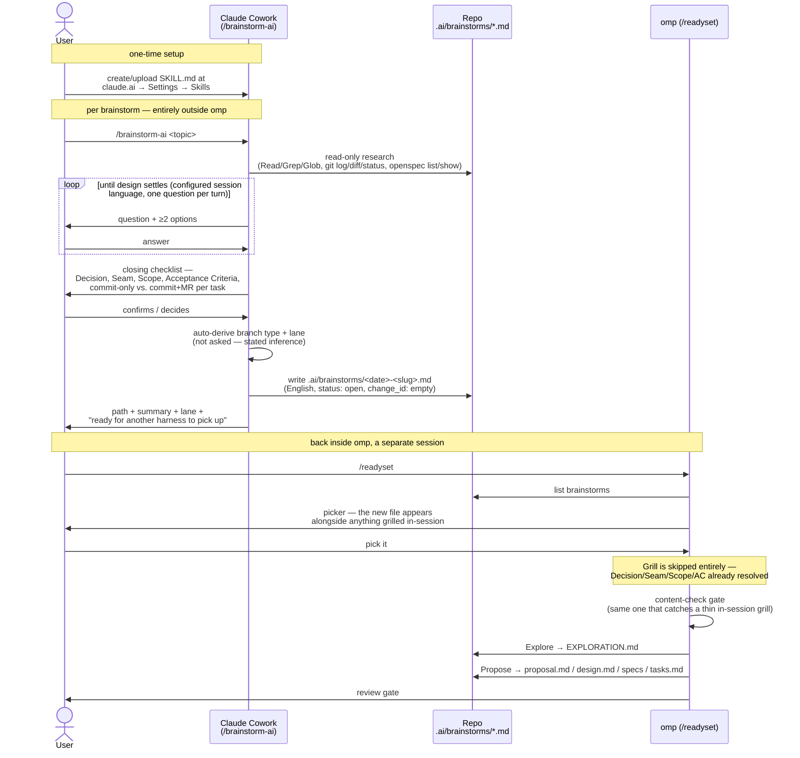

# brainstorm-ai

Authored by Freza (this package's maintainer), vendored here (originally verbatim, 2026-09-19,
then given a cosmetic `language` frontmatter field on 2026-09-19 — see below). It's meant to be
copied out and actually used, so its frontmatter has to stay the very first thing in the file
for a Claude Skill parser to accept it. Any provenance/usage notes belong here, in this sibling
file, not inside `SKILL.md` itself.

If you also have this skill uploaded as an account-level Skill at claude.ai (see "How to use it"
below), that copy won't pick up this change on its own — re-upload this `SKILL.md` there to get
the `language` field.

### `language` frontmatter field

The skill's session Q&A (questions, options, trade-off discussion, confirmations) was originally
hardcoded to Bahasa Indonesia. It now reads a `language: Indonesian` field in `SKILL.md`'s own
frontmatter instead — change that one line to switch the session's language, or remove the field
entirely to fall back to English. The saved `.ai/brainstorms/*.md` file itself is unaffected
either way: it's always written in English, so any downstream harness can pick it up without
translation.

## How to use it

Create/upload it as an account-level Skill at **claude.ai → Settings → Skills**. It then syncs
down to every surface that reads your synced skills (Claude Cowork, and Claude Code sessions
too — confirmed, not assumed: this package's own vendored copy was found by grepping a live
Claude Code session's `~/.claude/skills/synced/` directory, which is exactly where an
account-level Skill lands once synced). There's no per-repo copy step, and `readyset-flow
install` deliberately doesn't touch this folder at all — it's Claude account plumbing,
orthogonal to omp, not something the installer reads.

## Why it's here, not in `src/`

`src/skill/mattpocock-grilling.md` earns its place under `src/` because it's provenance
material: `grillTurnPrompt` in `src/extensions/readyset-review.ts` is literally adapted from
it. This skill has no such relationship to this package's code — nothing here is loaded,
installed, or adapted from it at runtime. It's a companion artifact for a different platform
(a Claude Skill, not an omp extension), kept here purely for discoverability, so it lives
outside `src/` on purpose.

## Sequence: Claude Cowork → `/readyset`

## Relationship to Readyset's own grilling

Readyset's own grilling turn (`/readyset <idea>`, see the README's "Grilling from outside omp")
matches this skill's closing discipline and file shape deliberately: Decision/Seam/Scope/
Acceptance Criteria, the same auto-derived branch-type/lane rules, the same `.ai/brainstorms/`
file shape. A brainstorm this skill writes and one Readyset's own grilling writes are
indistinguishable to Readyset's picker — either is a legitimate way to arrive at a
`.ai/brainstorms/*.md` file for `/readyset` to pick up.

## Portability

The YAML frontmatter in `SKILL.md` (`allowed-tools`, `disable-model-invocation`,
`argument-hint`, and the `$ARGUMENTS`/`` !`command` `` substitution syntax) is Claude Skill
plumbing — on a Claude surface it actually restricts which tools the skill can call. Using this
on a non-Claude assistant (ChatGPT desktop, say) hasn't actually been tried: in principle only
the body below the closing `---` fence would carry over, as plain instructions with no tool
restriction enforced. Untested theory, not a documented path.
